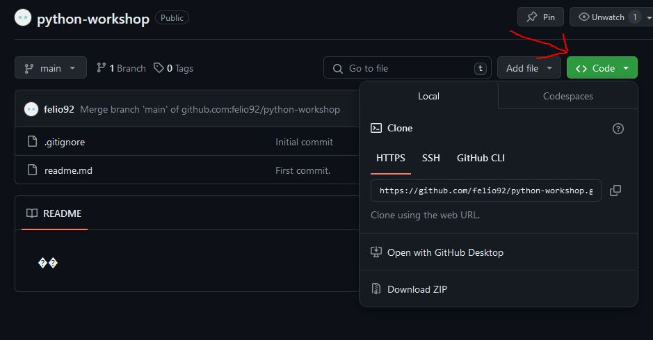
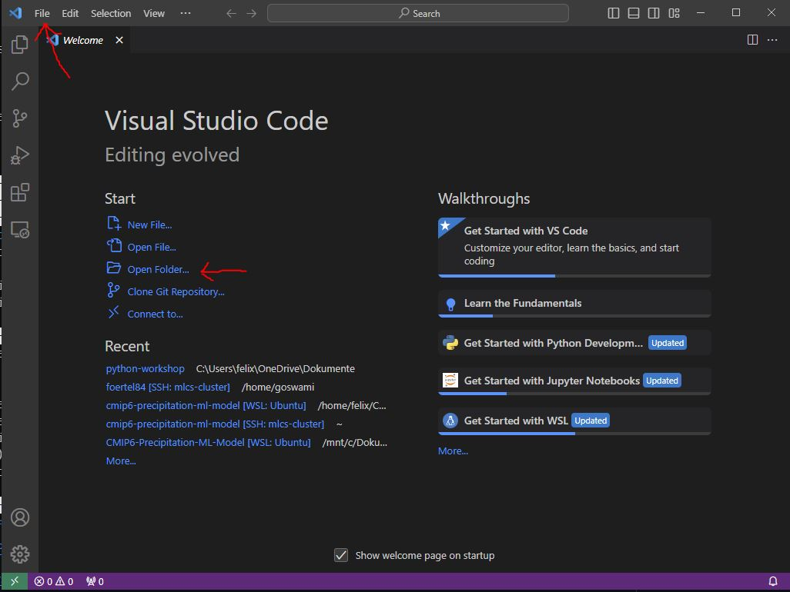
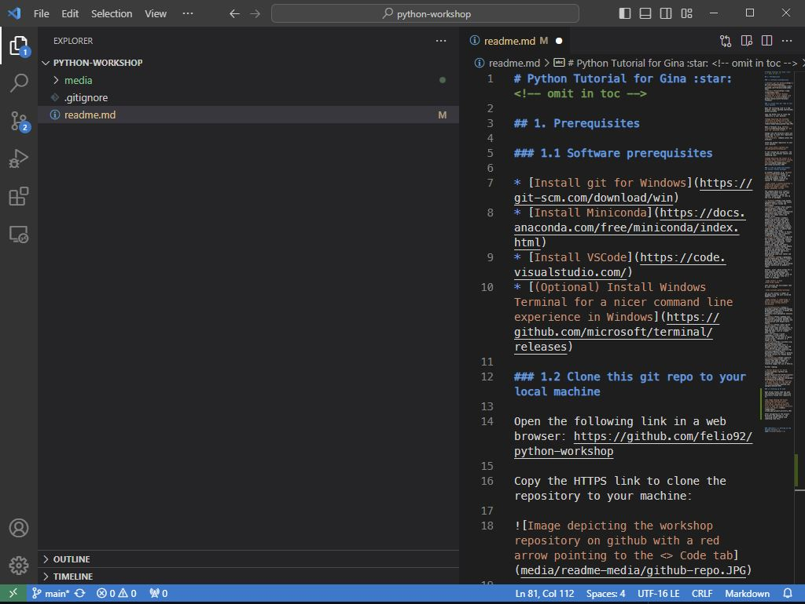
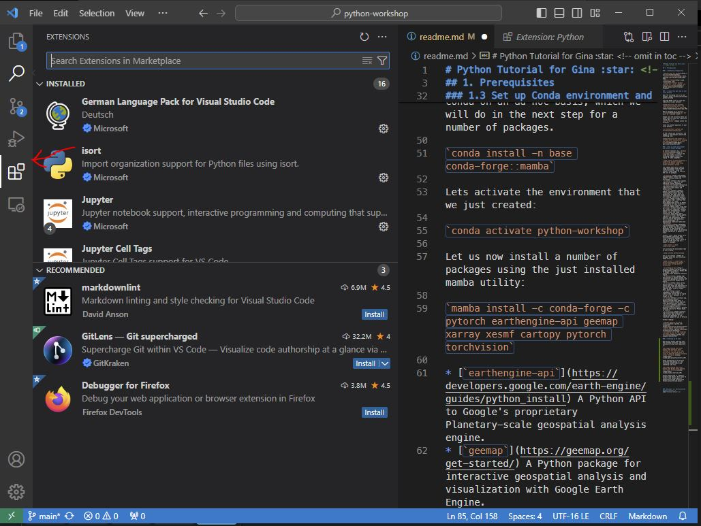
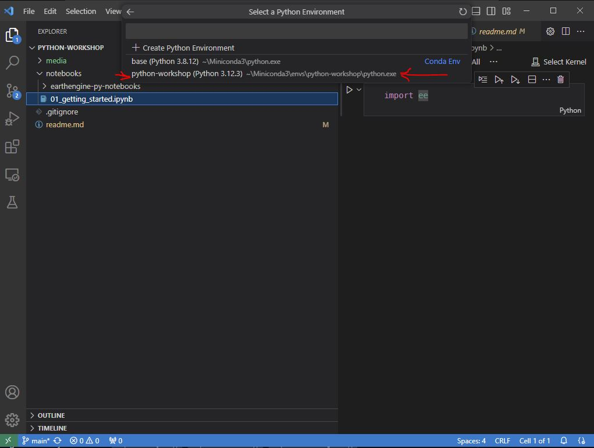

# Python Tutorial for Gina :star: <!-- omit in toc -->

## 1. Prerequisites

### 1.1 Software prerequisites 

* [Install git for Windows](https://git-scm.com/download/win)
* [Install Miniconda](https://docs.anaconda.com/free/miniconda/index.html)
* [Install VSCode](https://code.visualstudio.com/)
* [(Optional) Install Windows Terminal for a nicer command line experience in Windows](https://github.com/microsoft/terminal/releases)

### 1.2 Clone this git repo to your local machine

Open the following link in a web browser: https://github.com/felio92/python-workshop

Copy the HTTPS link to clone the repository to your machine:

Open a terminal (e.g. [Windows Terminal](#Terminal-Setup) or `Git Bash` or `Anaconda Prompt`)

Change into the directory where you would like to clone this repository (using the `cd C:\...\your-directory` command within the terminal)

Clone the github repository to your local machine:

`git clone https://github.com/felio92/python-workshop.git`

If the cloning was successful, the output in the terminal should look something like:

### 1.3 Set up Conda environment and install Python packages

In another terminal (e.g. [Windows Terminal](#Terminal-Setup) or `Anaconda Prompt`), create a new conda environment using the following command (confirm by typing 'Y' when prompted):

`conda create -n python-workshop -c conda-forge python=3.9 jupyter matplotlib seaborn numpy scipy pandas geopandas cartopy`

The command above will create a conda environment with the name "python-workshop", using the channel "conda-forge" to look up the list of packages:

* [`Python=3.9`](https://www.python.org/downloads/) Install the latest Python 3 version inside the environment.
* [`Jupyter`](https://docs.jupyter.org/en/latest/) Engine to run web-based Jupyter notebooks
* [`Matplotlib`](https://matplotlib.org/stable/index.html) Plotting library to create static and dynamic plots
* [`Seaborn`](https://seaborn.pydata.org/tutorial.html) Data visualization library based on matplotlib, but adds some extra functionality, especially useful for creating statistical graphics.
* [`NumPy`](https://numpy.org/doc/stable/index.html) A library that adds support for large, multi-dimensional arrays to Python. A dependency for many scientific computing Python libraries.
* [`SciPy`](https://docs.scipy.org/doc/scipy/) A widely used library for scientific computing. Contains modules for interpolation, linear alebra, signal and image processing, among many others.
* [`pandas`](https://pandas.pydata.org/docs/) A library for data analysis and manipulation. Offers data structures and operations, such as dataframes, for manipulating numerical tables and time series. 
* [`geopandas`](https://geopandas.org/en/stable/docs.html) A library based on pandas that extends its datatypes to make working with geospatial data easier, by allowing spatial operations on geometric types.  

Install `mamba` which allows for a much smoother experience when installing python packages via conda on an ad-hoc basis, which we will do in the next step for a number of packages.

`conda install -n base conda-forge::mamba`

Lets activate the environment that we just created:

`conda activate python-workshop`

Let us now install a number of packages using the just installed mamba utility:

`mamba install -c conda-forge -c pytorch earthengine-api geemap xarray xesmf cartopy pytorch torchvision`

* [`earthengine-api`](https://developers.google.com/earth-engine/guides/python_install) A Python API to Google's proprietary Planetary-scale geospatial analysis engine.
* [`geemap`](https://geemap.org/get-started/) A Python package for interactive geospatial analysis and visualization with Google Earth Engine.
* [`xarray`](https://docs.xarray.dev/en/stable/) A library that offers data types and operations to make working with multi-dimension, labelled data, such as climate data, easier.
* [`xesmf`](https://xesmf.readthedocs.io/en/stable/) A library that can be used to regrid xarray arrays / datasets in a number of ways.
* [`cartopy`](https://scitools.org.uk/cartopy/docs/latest/getting_started/index.html) A library to easily create maps and other geospatial data analyses.
* [`PyTorch`](https://pytorch.org/tutorials/beginner/basics/quickstart_tutorial.html) A machine learning library for Python based on Tensors. 
* [`torchvision`](https://pytorch.org/vision/stable/index.html) A library that adds a number of classes and datatypes to use / transform images for use in PyTorch.

Further reading:

* [Python Resource for Earth Sciences](https://github.com/javedali99/python-resources-for-earth-sciences)
* [Earth Engine Python Notebook Examples](https://github.com/giswqs/earthengine-py-notebooks)
* [A curated list of GEE resources (includes section for the GEE API for Python)](https://github.com/opengeos/Awesome-GEE)

### 1.4 Setting up VS Code 

Open Visual Studio Code and open the workshop directory, where you previously cloned this repository to:

After navigating to the project directory and opening it, the resulting window should look something like this:

Visual Studio Code is a general purpose code editor. We'll want to install some Python-specific extensions to make working with Python within VS Code easier. To install the extensions, click (shortcut Ctrl+Shift+X) the extensions icon on the toolbar on the left:

We'll want to search and install the following extensions:

* `ms-python.python` Python extension for Visual Studio Code
* `ms-toolsai.jupyter` Adds support for jupyter notebooks within VS Code

### 1.5 Opening our first Jupyter Notebook in VS Code

Open the `01_getting_started.ipynb` notebook in VS Code, which is found in the `notebooks` directory. You should be prompted to select a Python Environment:

Select the `python-workshop` environment, where we have installed all packages that we'll be using in this workshop.

### (Optional) 1.x Setting up the Windows Terminal  

